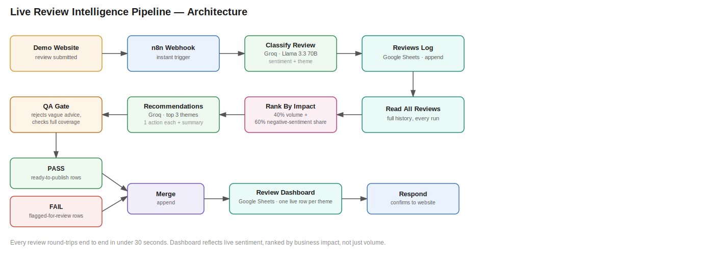

# Live Review Intelligence Pipeline

A real-time automation that turns incoming customer reviews into ranked, actionable business intelligence — no batch jobs, no manual tagging. A review comes in, and within ~30 seconds a live dashboard reflects updated priorities and a QA-checked recommendation.

Built with **n8n**, **Groq (Llama 3.3 70B, free tier)**, and **Google Sheets**. Zero paid infrastructure.

📄 **Full write-up (problem framing, design rationale, what I'd build next):** [Notion Link]([https://kind-horse-076.notion.site/Live-Return-Intelligence-Prioritisation-Engine-ba6b2fef471b4b418547d0682fcdcb56])

Also included in this repo is the case study stored as `LRIPE-CASE-STUDY.md`.

## What it does

1. A review is submitted (from the included demo storefront, or any system that can POST JSON)
2. An n8n webhook picks it up instantly and classifies it — **sentiment** (positive/negative/neutral) and **theme** (Sizing/Fit, Quality, Shipping, Price, Customer Service, Packaging, Other)
3. The review is logged to a **Reviews Log** Google Sheet
4. The workflow reads back the *entire* history and recomputes theme rankings using a weighted impact score:
   `priority = 0.4 × (volume share) + 0.6 × (share of negative sentiment)`
   — this means a theme with fewer total mentions but a high negative rate can still outrank a louder but mostly-positive theme.
5. For the top 3 ranked themes, an LLM call drafts one concrete corrective action each, plus an executive summary
6. A **QA gate** rejects the output if it uses vague filler ("monitor the situation," "improve quality"), or if it fails to cover every top theme — flagged output is routed to a "needs review" state instead of silently shipping
7. Passing output updates a **Review Dashboard** Google Sheet — one live row per theme, refreshed (not duplicated) on every new relevant review

## Repo contents

| File | What it is |
|---|---|
| `live-review-pipeline-workflow.json` | The full n8n workflow — import via n8n's *Import from File* |
| `review-demo-website.html` | Standalone demo storefront with a review form + an auto-simulation mode that submits a new random review every few seconds |
| `architecture-diagram.svg` | Visual pipeline diagram (above) |
| `CASE-STUDY.md` | Narrative write-up — problem framing, design rationale, what I'd build next |

## Setup

**Requirements (all free):**
- [n8n](https://n8n.io) — self-hosted (`npx n8n`) or n8n Cloud free trial
- [Groq API key](https://console.groq.com) — free tier, no card
- A Google account for two Sheets: **Reviews Log** and **Review Dashboard**

**Steps:**
1. Import `live-review-pipeline-workflow.json` into n8n
2. Connect a Google Sheets OAuth2 credential on the three Sheets nodes (`Log Review To Sheet`, `Read All Reviews`, `Update Live Dashboard`), pointing the first two at *Reviews Log* and the third at *Review Dashboard*
3. Set `Log Review To Sheet`'s operation to **Append Row**; set `Update Live Dashboard`'s operation to **Append or Update**, matching on the `Theme` column
4. Paste your Groq API key into the `Extract Review + Groq Key` node
5. Publish/activate the workflow, copy its webhook URL into `review-demo-website.html`
6. Open the HTML file in a real browser tab (not a sandboxed preview) and submit a review, or click **Start Live Simulation**

## Design decisions worth calling out

- **Impact-weighted ranking, not raw volume.** Most naive review dashboards just count mentions. Weighting by negative-sentiment share surfaces problems that are small in volume but disproportionately damaging — the same ROI-based prioritization logic used in AI adoption/use-case scoring, just automated.
- **A QA gate before anything ships.** The pipeline doesn't trust the LLM's output by default — it mechanically checks coverage and rejects generic advice, routing failures to a distinct "needs review" state rather than either blocking entirely or shipping bad output silently.
- **Recompute from full history, not incremental patching.** Every single review triggers a full re-read and re-rank of the whole dataset. This trades a little efficiency for a dashboard that's always internally consistent — no drift between what's logged and what's ranked.

## Possible extensions

- Swap the keyword-based QA gate for an LLM-judge call for stricter, less brittle checks
- Add a scheduled digest (daily/weekly) alongside the real-time updates, for a periodic executive summary
- Replace the demo storefront with a real review-import source (Shopify webhook, CSV import, marketplace API)
